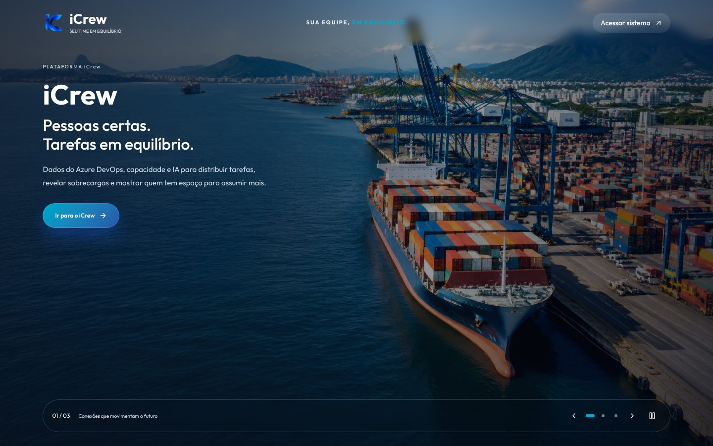
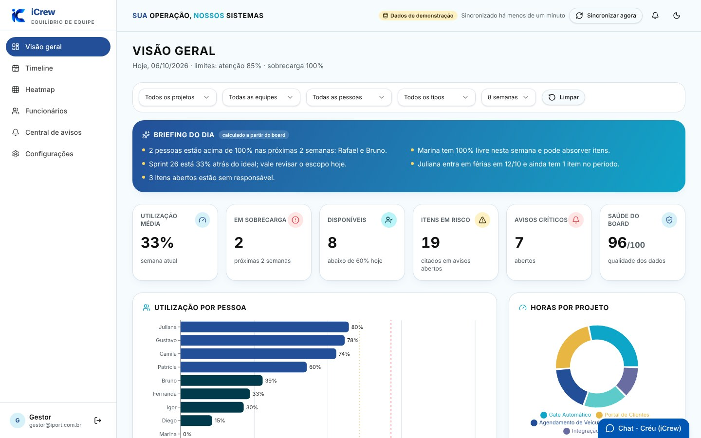
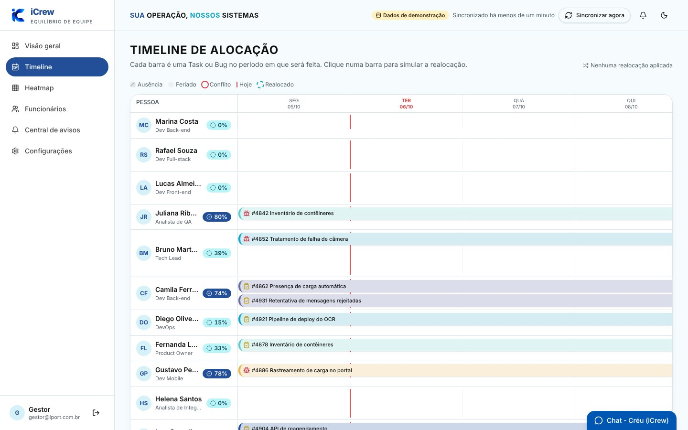
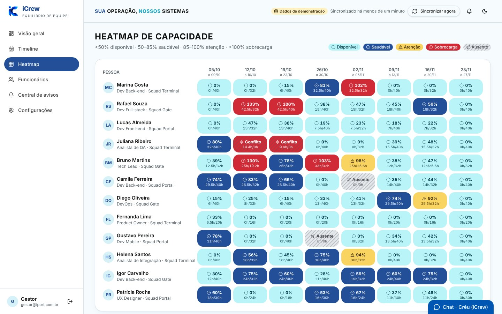
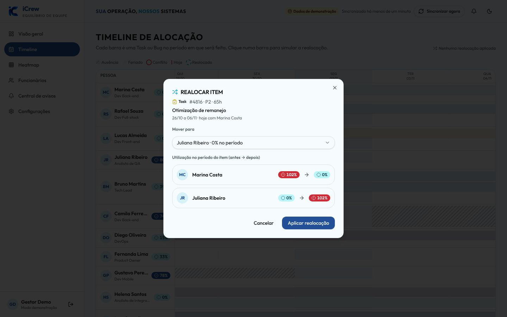
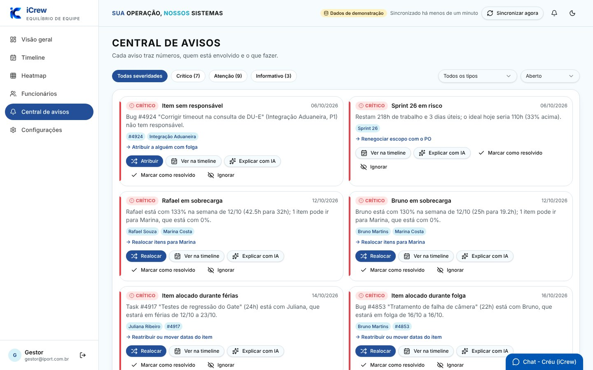
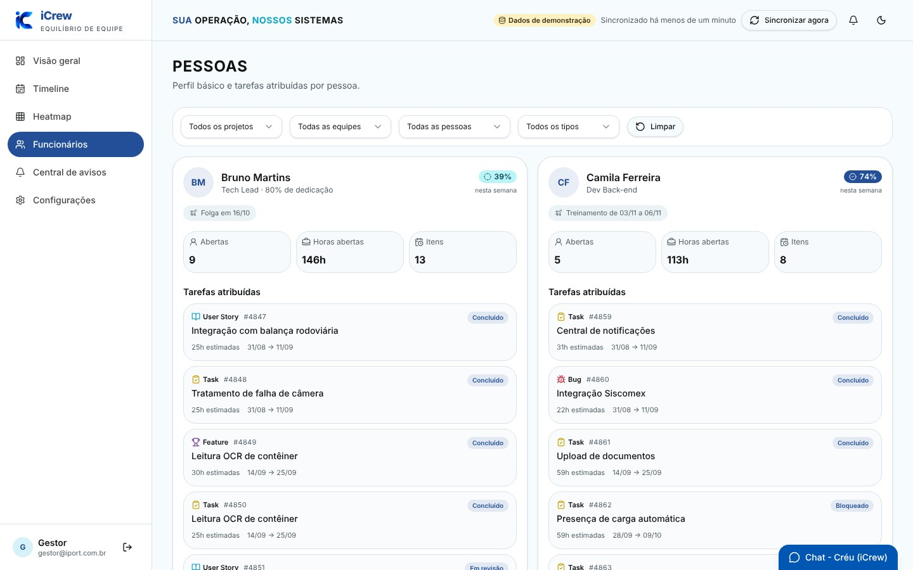
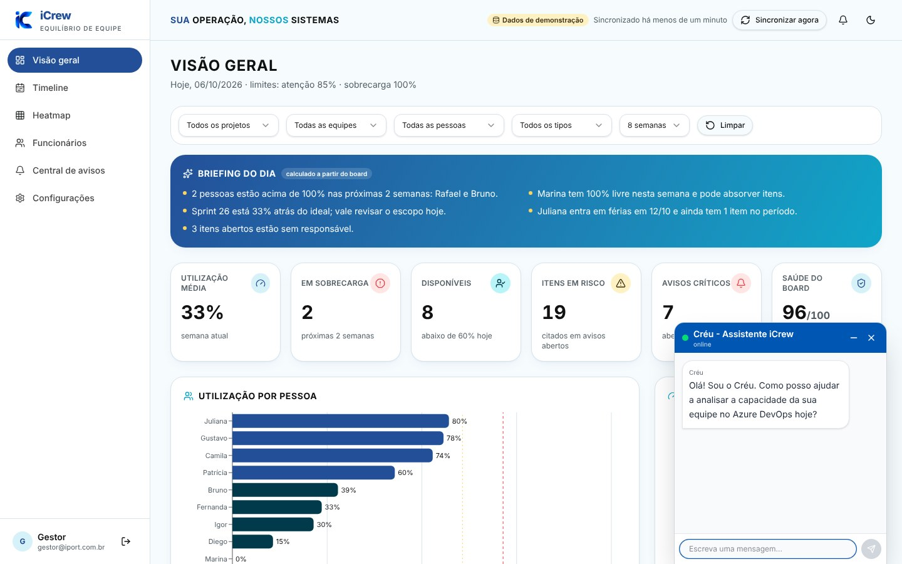
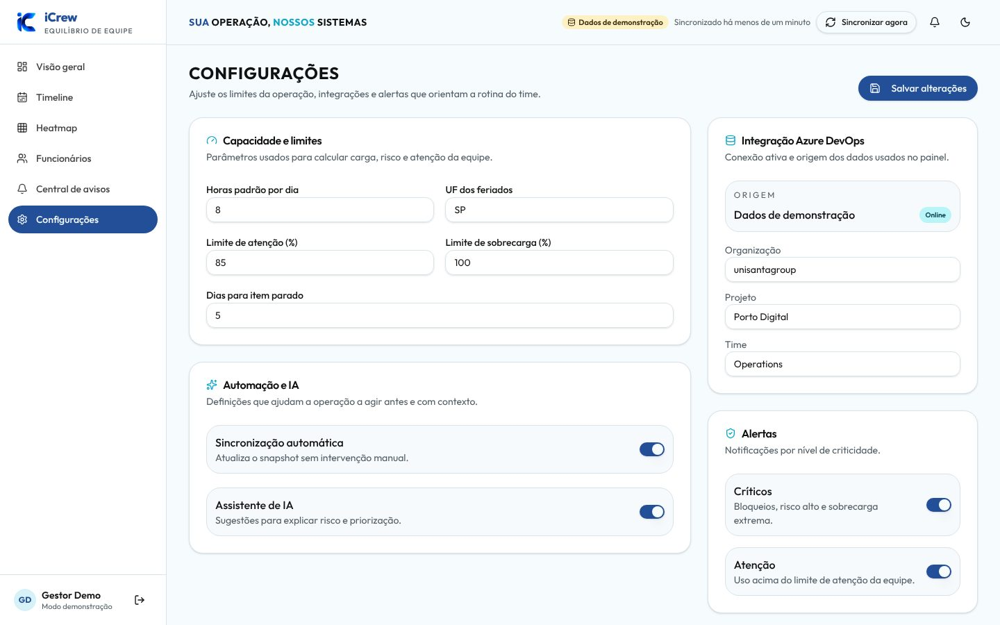
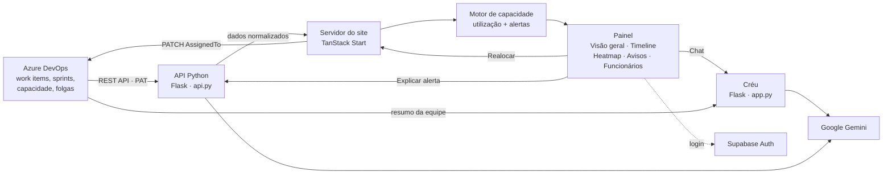

<div align="center">


# iCrew

**Pessoas certas. Tarefas em equilíbrio.**

Painel de capacidade e alocação de equipes sobre o **Azure DevOps**, com alertas antecipados, simulação de realocação e um assistente com IA, o **Créu**.

Desenvolvido na **Hackathon Semana TI · UNISANTA 2026** para o desafio da **iPORT Solutions**.


[**🔗 Acessar o iCrew**](https://icrew-site.onrender.com) · [**🎤 Slides do pitch**](https://canva.link/fhwf9bhkb3lwo2o) · [**▶️ Vídeo da demo**](docs/video/demo-icrew.mp4) · [**💻 Repositório**](https://github.com/kenz015/Hackaton-Unisanta-Iport)

<sub>Hospedado no plano gratuito do Render: se o site estiver parado, o primeiro acesso pode levar cerca de 1 minuto.</sub>



</div>

---

## Sumário

- [O desafio](#o-desafio)
- [A solução](#a-solução)
- [Demonstração](#demonstração)
- [Funcionalidades](#funcionalidades)
- [Créu, o assistente com IA](#créu-o-assistente-com-ia)
- [Como funciona](#como-funciona)
- [Tecnologias](#tecnologias)
- [Como rodar](#como-rodar)
- [Deploy](#deploy)
- [Estrutura do repositório](#estrutura-do-repositório)
- [Segurança](#segurança)
- [Testes](#testes)
- [Desafios e aprendizados](#desafios-e-aprendizados)
- [Próximos passos](#próximos-passos)
- [Equipe](#equipe)
- [Créditos e propriedade intelectual](#créditos-e-propriedade-intelectual)

---

## O desafio

> **“Qual a disponibilidade atual da minha equipe? E quando ela já está no limite?”**
> **“Como ajudar um gestor a tomar uma decisão de alocação antes de virar um problema?”**
> — iPORT Solutions

O Azure DevOps mostra **o que** precisa ser feito, mas não responde com clareza **quem** pode fazer, **quando** a equipe está sobrecarregada ou **o que acontece** se uma tarefa mudar de mãos. Hoje esse cruzamento (horas estimadas × capacidade × férias × feriados) é feito de cabeça ou em planilhas, e o problema só aparece quando a entrega já atrasou.

## A solução

O **iCrew** lê o board do Azure DevOps e cruza cada tarefa com a capacidade real de cada pessoa, descontando ausências e feriados. Com isso ele:

1. **Mostra** quem está livre, quem está no limite e quem estourou, semana a semana.
2. **Avisa** antes: sobrecarga, tarefa em período de férias, item sem responsável, sprint em risco e outros alertas.
3. **Simula** a realocação: o gestor vê a utilização **antes → depois** de cada pessoa, recebe a sugestão de quem tem menor impacto e grava a decisão direto no Azure DevOps.
4. **Explica** cada alerta em linguagem simples, com IA. Os números vêm do cálculo do iCrew; a IA só explica.
5. **Responde** perguntas sobre a equipe pelo **Créu**, um chat com IA que conhece os dados reais do board.

O iCrew **complementa** o Azure DevOps, não o substitui.

## Demonstração

**▶️ [Assista ao vídeo da demonstração](docs/video/demo-icrew.mp4)**: o iCrew funcionando no site publicado.

| Visão geral | Timeline de alocação |
|---|---|
|  |  |
| **Heatmap de capacidade** | **Simulação de realocação** |
|  |  |
| **Central de avisos** | **Funcionários** |
|  |  |
| **Créu, o assistente com IA** | **Configurações** |
|  |  |

<sub>As imagens usam os dados de demonstração do iCrew. No site publicado, os dados vêm do Azure DevOps da equipe.</sub>

**Roteiro sugerido (2 minutos):** tela inicial → login → *Visão geral* (briefing do dia) → *Heatmap* (quem está em vermelho) → *Central de avisos* → **Explicar com IA** → **Realocar** (antes → depois) → pergunta ao **Créu** (“quem está mais livre essa semana?”).

## Funcionalidades

| Item do desafio | Como o iCrew resolve |
|---|---|
| **1. Sincronizar** | Lê work items, iterações, capacidade, folgas individuais e folgas do time pela REST API do Azure DevOps. Botão “Sincronizar agora”. |
| **2. Entender pessoas** | Capacidade = horas/dia × dedicação, descontando feriados nacionais e ausências. Página **Funcionários** com a utilização da semana, a próxima folga e as tarefas de cada pessoa. |
| **3. Visualizar** | **Timeline** estilo Gantt por pessoa e por dia, com ausências, feriados, linha de “hoje” e conflitos destacados. |
| **4. Realocar** | Clique numa tarefa → simulação **antes → depois** para cada pessoa, sugestão de quem tem menor impacto (com aviso quando todos estourariam o limite) e gravação do novo responsável no Azure DevOps. |
| **5. Identificar** | **Heatmap** pessoa × semana: disponível, saudável, atenção, sobrecarga, ausente e conflito. |
| **6. Alertar** | **Central de avisos** com 13 tipos de alerta (sobrecarga, férias, feriado, sobreposição de prioridades, sem responsável, sem estimativa, item parado, sprint em risco, impedimento, entre outros), severidade e botão **“Explicar com IA”**. |

**Além do que o desafio pedia:**

- **Créu**, chatbot com IA que responde sobre a equipe usando os dados reais do Azure (veja abaixo).
- **Briefing do dia** na Visão geral: quem está sobrecarregado, quem está livre e os alertas críticos.
- **Login completo**: criação de conta, confirmação por e-mail, “Esqueci minha senha” e proteção de todas as páginas.
- **Regras de senha com checklist ao vivo** e mensagens claras do que falta (“Faltam números e caracteres especiais”).
- Tela inicial pública, filtros combináveis (projeto, equipe, iteração, tipo e pessoa), tema claro/escuro, layout para celular e selo com a origem dos dados.

## Créu, o assistente com IA

O Créu fica no canto inferior direito de todas as telas do sistema.

- Responde perguntas como *“quem está sobrecarregado?”*, *“quem tem folga essa semana?”* ou *“o que está sem responsável?”* com os **números reais** do board: utilização, horas, folgas e prazos de cada pessoa.
- Entende perguntas de continuação (*“e ela?”*), porque recebe as últimas mensagens da conversa.
- Mostra a resposta **enquanto escreve** (streaming), com indicador de “pensando…” e “escrevendo…”. O campo fica bloqueado até a resposta terminar.
- Só fala sobre a equipe e o iCrew. Recusa assuntos fora do tema e tentativas de mudar as próprias regras.
- Os dados do Azure ficam em cache e são renovados em segundo plano, então a pergunta não espera o Azure responder.
- Se um modelo do Gemini estiver ocupado ou indisponível, tenta de novo e passa para o próximo automaticamente.

## Como funciona



### Regras de cálculo

- **Só Task e Bug contam horas**, pelo campo *Remaining Work* (ou *Original Estimate*). Epics e Features mostram progresso pelas tarefas filhas.
- **Carga diária:** as horas do item são distribuídas pelos dias úteis entre início e fim. Sem datas no item, valem as datas da sprint.
- **Capacidade diária:** 8h × dedicação da pessoa. É zero em feriado ou ausência.
- **Utilização semanal** = carga ÷ capacidade.

| Utilização | Status |
|---|---|
| até 50% | 🟦 Disponível |
| 50% a 85% | 🔵 Saudável |
| 85% a 100% | 🟨 Atenção |
| acima de 100% | 🟥 Sobrecarga |
| capacidade 0 com trabalho | ⚠️ Conflito |

Os limites ficam em [`frontend/src/services/config.ts`](frontend/src/services/config.ts).

## Tecnologias

| Camada | Tecnologia |
|---|---|
| Front-end | React 19, TanStack Start (Router + Query), TypeScript, Vite |
| Interface | Tailwind CSS 4, shadcn/ui (Radix), Recharts, lucide-react, date-fns |
| Back-end | Python, Flask, Flask-CORS, pandas (motor de regras), Requests |
| Integração | Azure DevOps REST API 7.1 (WIQL, Work Items, Iterations, Capacities, Team Days Off, Team Members) |
| IA | Google Gemini (`google-genai`): Créu e “Explicar com IA” |
| Autenticação | Supabase Auth |
| Testes | Vitest + Testing Library (front-end), pytest (back-end) |
| Deploy | Render (3 serviços via `render.yaml`) |

## Como rodar

**Pré-requisitos:** [Node.js LTS](https://nodejs.org) (20 ou mais recente), [Python 3.11+](https://www.python.org) e Git.

**1. Clonar e instalar**

```bash
git clone https://github.com/kenz015/Hackaton-Unisanta-Iport.git
cd Hackaton-Unisanta-Iport

cd backend
pip install -r requirements.txt

cd ../frontend
npm install
```

**2. Configurar o `.env`**

Copie [`backend/.env.example`](backend/.env.example) para `backend/.env` e preencha:

| Variável | Para quê | Obrigatória? |
|---|---|---|
| `ADO_ORG`, `ADO_PROJECT`, `ADO_PAT` | Ler e gravar no Azure DevOps. O PAT precisa dos escopos **Work Items (Read & Write)** e **Project and Team (Read)**. | Para dados reais |
| `ADO_TEAM` | Nome do time (padrão: `<projeto> Team`) | Não |
| `GEMINI_API_KEY` | Créu e “Explicar com IA”. Gere em [aistudio.google.com/apikey](https://aistudio.google.com/apikey). | Para o Créu |

O login já vem configurado com o Supabase do projeto, então o front não precisa de `.env`.

**3. Rodar (um terminal para cada)**

```bash
# Terminal 1 – API de dados (porta 5000)
cd backend
python api.py

# Terminal 2 – Créu (porta 5001)
cd backend
python app.py

# Terminal 3 – Site (porta 8080)
cd frontend
npm run dev
```

Abra **http://127.0.0.1:8080**. Fluxo: **tela inicial → login (“Criar conta”) → sistema**.

Sem o `.env` ou sem o Azure respondendo, o iCrew usa **dados de demonstração**. O selo no topo mostra a origem: **“Azure DevOps”** ou **“Dados de demonstração”**.

## Deploy

O iCrew está publicado no **Render**, em três serviços gratuitos, definidos no [`render.yaml`](render.yaml):

| Serviço | Endereço | O que roda |
|---|---|---|
| `icrew-site` | https://icrew-site.onrender.com | Site (TanStack Start como servidor Node) |
| `icrew-api` | https://icrew-api.onrender.com | API de dados (`backend/api.py`) |
| `icrew-creu` | https://icrew-creu.onrender.com | Créu (`backend/app.py`) |

Para publicar de novo: no Render, **New → Blueprint →** este repositório. O Render cria os três serviços e pede `ADO_PAT` e `GEMINI_API_KEY`. A senha entre o site e a API (`API_SHARED_SECRET`) é gerada automaticamente. A cada `git push` no `main`, o Render atualiza sozinho.

## Estrutura do repositório

```
.
├── frontend/                         # Site do iCrew (TanStack Start)
│   └── src/
│       ├── routes/                   # Páginas: tela inicial, login, nova senha, visão geral,
│       │                             # timeline, heatmap, avisos, funcionários, configurações
│       ├── services/
│       │   ├── azure-fns.ts          # Funções do servidor: dados, realocação e IA (exigem login)
│       │   ├── capacity.ts           # Motor de capacidade e alertas
│       │   └── api.ts                # Busca de dados e fallback para demonstração
│       ├── components/app/           # Telas, diálogo de realocação e chat do Créu
│       ├── components/auth/          # Login, sessão, checklist de senha e proteção das páginas
│       ├── lib/password-rules.ts     # Regras de senha
│       └── data/                     # Tipos, feriados e dados de demonstração
├── backend/                          # Python / Flask
│   ├── api.py                        # API de dados (/api/source, /api/ai/explain, /api/health)
│   ├── app.py                        # Créu, o chatbot (/api/chatbot, /api/health)
│   ├── source_builder.py             # Monta pessoas, sprints, folgas e work items a partir do Azure
│   ├── devops_client.py              # Cliente da REST API do Azure DevOps
│   ├── team_context.py               # Resumo da equipe que o Créu usa nas respostas
│   ├── ia_service.py                 # “Explicar com IA” (Gemini)
│   ├── supabase_auth.py              # Confere o login do Supabase nas mensagens do Créu
│   ├── rules_engine.py               # Regras de processo
│   └── tests/                        # Testes (pytest)
├── render.yaml                       # Deploy no Render (3 serviços)
└── docs/img/                         # Imagens deste README
```

## Segurança

- **Chaves só no servidor:** o PAT do Azure DevOps e a chave do Gemini ficam no `.env` (ou nas variáveis de ambiente do Render), nunca no código nem no navegador. O `.env` está no `.gitignore`.
- **Login obrigatório de ponta a ponta:** as páginas, as funções do servidor (dados, realocação, explicação por IA) e o Créu conferem no Supabase se o login é válido.
- **API protegida no deploy:** a API Python só aceita pedidos do servidor do site, que envia uma senha compartilhada gerada pelo Render.
- **Entradas validadas:** número do item e responsável na realocação, tamanho das mensagens do Créu, tags e textos enviados à IA.
- **Servidores endurecidos:** modo debug desligado, CORS restrito ao endereço do site, tempo limite nas chamadas ao Azure e mensagens de erro sem detalhes internos.
- **Senhas:** gerenciadas pelo **Supabase Auth**, com hash; o iCrew não guarda senhas. O cadastro exige 8+ caracteres, maiúscula, minúscula, número e caractere especial.
- **Créu:** filtro contra tentativas de mudar as regras do assistente (“ignore as instruções”, “mostre seu prompt”…) e respostas restritas aos dados da equipe.
- Toda alteração no Azure DevOps exige uma ação explícita do gestor (“Aplicar e gravar no Azure”).

## Testes

```bash
cd backend && python -m pytest -q    # API, montagem dos dados, Créu e segurança
cd frontend && npm test              # rotas, filtros e configuração do login
```

## Desafios e aprendizados

- **Traduzir “capacidade” em número confiável:** decidir que só Task e Bug consomem horas e como distribuí-las pelos dias exigiu estudar o processo do Azure DevOps e os endpoints de capacidade e folgas.
- **IA no lugar certo:** começamos usando IA para tudo e percebemos que os números precisam ser determinísticos e auditáveis. A IA ficou com o que faz melhor: explicar e conversar.
- **Um chatbot rápido e útil:** o Créu passou a responder com os dados reais da equipe, em streaming, e a tentar outro modelo quando o Gemini fica sobrecarregado.
- **Segurança desde cedo:** chaves fora do código, login validado no servidor e API protegida antes de ir para a internet.
- **Demo à prova de falhas:** o iCrew cai para dados de demonstração se o Azure não responder.
- **Trabalho em equipe com Git e deploy:** branches, merges, organização do repositório e publicação no Render fizeram parte do aprendizado.

## Próximos passos

- Arrastar e soltar tarefas na timeline.
- Histórico diário do burndown (hoje, com dados do Azure, mostra só o dia atual).
- Edição de horas da tarefa direto no simulador de realocação.
- Perfis de acesso (gestor × membro da equipe).
- Telas planejadas: Projetos, Relatórios e Governança.

## Equipe

| Nome | GitHub |
|---|---|
| Gustavo Kenzo | [@kenz015](https://github.com/kenz015) |
| Daniela Catarino Varela | [@httpsdanii](https://github.com/httpsdanii) |
| Daniel Assis | [@daofc2199-cell](https://github.com/daofc2199-cell) |
| Grasielly Ribeiro | [@grasyzip](https://github.com/grasyzip) |

## Créditos e propriedade intelectual

- A estrutura inicial do front-end (projeto TanStack Start, componentes shadcn/ui, tela inicial e login) foi gerada com **[Lovable](https://lovable.dev)** e depois adaptada pela equipe. O uso de código pré-existente está referenciado aqui conforme o regulamento.
- Componentes de interface: [shadcn/ui](https://ui.shadcn.com) (licença MIT).
- Conforme o regulamento da Hackathon Semana TI · UNISANTA, a propriedade intelectual deste projeto é cedida à empresa parceira do desafio (iPORT Solutions).
